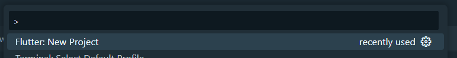
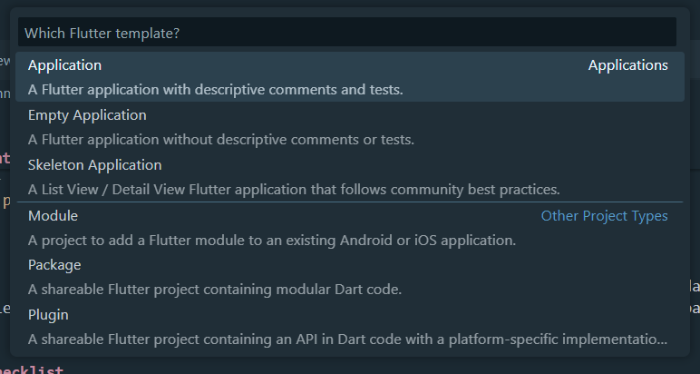
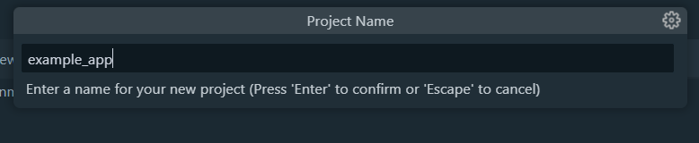

# 

Celestia is a Hoyoverse Official Merchandise E-Commerce that offers some products officially made by Hoyoverse. This Project was made for one of the task in <a href="https://pbp-fasilkom-ui.github.io/ganjil-2025/"> Pemrograman Berbasis Platform (PBP) Gasal 2024/2025</a>.

<br>

> **Note:** <br> This is not an actual online shop for Hoyoverse Merchandise. <br>The mockup design on the banner was taken from [Tokopedia](https://tokopedia.com) Mobile App.

<br>

# 📝 Assignment
**Nama**    : Daniel Liman<br>
**NPM**     : 2306220753<br>
**Kelas**   : PBP F

<!-- | Tugas Sebelumnya: | [Tugas 7](https://github.com/hyvos07/celestia-mobile/wiki/Tugas-7) |
|-|-| -->

<!-- <br> -->

## Tugas 7
### Stateless Widget dan Stateful Widget
Seperti namanya, **Stateless** dan **Stateful** widget memiliki perbedaan di *state* yang mereka miliki.
- **Stateless Widget**

    Stateless widget tidak dapat menyimpan sebuah state di dalamnya. Hal ini berarti subkomponen dan atribut yang mereka punya (misalnya teks pada Text widget dan icon yang dimiliki oleh Icon widget) tidak dapat diubah lagi setelah widget di-build atau ditampilkan di layar. Untuk mengubah isi dari stateless widget, kita perlu melakukan pemanggilan ulang widget tersebut dan mengisinya dengan isi yang baru.

    Berikut contoh dari Stateless Widget.
    ```dart
    class ProfileBar extends StatelessWidget {
        const ProfileBar({
            required this.imageUrl
            required this.name,
            super.key,
        });

        final String imageUrl;
        final String name;

        @override
        Widget build(BuildContext context) {
            return Row(
                children: [
                    CircleAvatar(backgroundImage: Image.network(imageUrl)),
                    Text(name),
                ],
            );
        }
    }
    ```
    Pada contoh di atas, kita tidak bisa secara langsung mengubah URL dari foto profil dan nama yang akan ditampilkan pada widget `ProfileBar` tersebut. Kita perlu mendefinisikan ulang widget `ProfileBar` dan memanggilnya ulang di kode kita.

- **Stateful Widget**

    Berbeda dengan stateless widget, stateful widget memiliki *inner state* yang dapat disimpan dan diubah lewat method `setState()` yang dimiliki oleh stateful widget. Modifikasi state bisa kita lakukan kapanpun selama widget belum dibuang (atau `dispose()`) di lifecycle-nya. Contoh dari widget bawaan yang mengimplementasikan stateful widget ini adalah `Checkbox`.

    Salah satu contoh dari stateful widget adalah widget counter yang mirip dengan yang ada di project demo Flutter.
    ```dart
    class CounterBar extends StatefulWidget {
        const CounterBar({super.key});

        @override
        _CounterBarState createState() => _CounterBarState();
    }

    class _CounterBarState extends State<CounterBar> {
        int _counter = 0;

        // Menambahkan dan Mengurangi angka pada counter
        // dapat dilakukan dengan memakai setState()

        void _increment() {
            setState(() {
                // setState untuk menambahkan angka
                _counter++;
            });
        }

        void _decrement() {
            setState(() {
                // setState untuk mengurangi angka
                if (_counter > 0) _counter--;
            });
        }

        @override
        Widget build(BuildContext context) {
            return Row(
                mainAxisAlignment: MainAxisAlignment.center,
                children: <Widget>[
                    IconButton(
                        icon: const Icon(Icons.remove),
                        onPressed: _decrement,
                    ),
                    Text('$_counter'),
                    IconButton(
                        icon: const Icon(Icons.add),
                        onPressed: _increment,
                    ),
                ],
            );
        }
    }
    ```

    Pemakaian `setState()` di atas akan melakukan build ulang terhadap widget, yang akan menampilkan tampilan UI baru dengan data yang juga berbeda dengan state sebelumnya. Selain dari perubahan state, stateful widget sebenarnya juga bisa berubah dengan membuat ulang widget yang baru seperti pengubahan data pada stateless widget.


### Widget yang dipakai pada Tugas 7
Berikut widget-widget yang dipakai pada Tugas 7 ini:
| Nama Widget | Keterangan |
| ----------- | ---------- |
| `App()` | Widget ini menjadi basis dari aplikasi dari project Flutter ini, yang berisi `MaterialApp()` dan `MyHomePage()` |
| `MyHomePage()` | Widget ini berisi home page yang berisi konten yang menjadi tampilan utama saat pengguna membuka aplikasi dari awal. |
| `Scaffold()` | Seperti bangunan yang mempunyai tiang besi dan beton, `Scaffold()` berperan seperti struktur dasar atau kerangka dari aplikasi kita.  |
| `AppBar()` | Menampilkan app bar dari aplikasi kita di bagian atas layar. |
| `Padding()` | Widget ini akan menambahkan space kosong yang diukur memakai pixel di sekitar widget yang dibungkusnya. |
| `Column()` | Digunakan untuk menyusun widget-widget yang dibungkusnya secara **vertikal**. |
| `Row()` | Digunakan untuk menyusun widget-widget yang dibungkusnya secara **horizontal**. |
| `CircleAvatar()` | Menampilkan gambar (dalam konteks project ini foto profil dari pengguna) dalam bentuk lingkaran. |
| `CachedNetworkImageProvider()` | Memuat gambar profil dari URL yang diberikan dan menyimpannya pada cache di dalam device. |
| `Text()` | Menampilkan teks dengan gaya tertentu. Pada projek ini, widget `Text()` digunakan untuk menampilkan teks sapaan, nama, dan detail pengguna. |
| `GridView.count()` | Widget yang membuat layout grid untuk menampilkan daftar item yang ada di widget `ItemCard()`. |
| `ItemCard()` | Widget yang menampilkan tombol `Inkwell()`, dengan fungsionalitas bergantung dengan objek `ItemHomePage()` yang dimilikinya. |
| `Material()` | Membungkus widget `InkWell()` untuk memberikan warna/color di latar belakang dan border radius. |
| `InkWell()` | Widget ini berfungsi mirip seperti tombol, yang menambahkan efek sentuh dan fungsi klik pada `ItemCard()`. |
| `SnackBar()` | Menampilkan pesan singkat ketika sebuah `ItemCard()` ditekan, yang menampilkan pesan yang berkorelasi dengan `ItemCard()` yang ditekan. |
| `Container()` | Widget ini berfungsi sebagai pembungkus general dari widget-widget di Flutter. Container bisa memiliki warna latar belakang, padding, margin, dan border sendiri. |
| `Icon()` | Menampilkan gambar icon di `ItemCard()` yang berhubungan dengan nama iconnya. List dari setiap icon yang ada di Icons bisa dilihat [disini](https://api.flutter.dev/flutter/material/Icons-class.html). |


### Fungsi dari `setState()`
Seperti yang dijelaskan di awal, `setState()` adalah sebuah method untuk stateful widget yang dapat merubah state atau isi dari widget tersebut. Pada contoh widget `CounterBar` tadi, `setState()` dapat menambah atau mengurangi variable `_counter` yang menjadi isi dari widget `CounterBar` tersebut. Setiap kali `setState()` dipanggil, Flutter akan melakukan build ulang widget tersebut sehingga perubahan pada state akan tercermin pada tampilan UI.


### Perbedaan di antara `const` dan `final`
Sama seperti di bahasa pemrograman lainnya (Java, Javascript, dll), `const` dan `final` digunakan untuk membuat suatu variable yang nilainya tidak berubah (immutable). 

Bedanya, `final` memperbolehkan program untuk memodifikasi isi dari instance object yang ada di variable tersebut secara runtime, namun tidak bisa mengganti isi dari variable tersebut dengan instance yang lain. Berbeda dengan `final`, `const` memiliki nilai konstant dan tetap dari awal dideklarasikan atau saat di-compile, sehingga tidak akan bisa diubah isinya hingga akhir.

Beberapa perbedaan `final` dan `const` dapat dilihat di beberapa kasus, seperti:

- Inisialisasi

    ```dart
    // final -- nilai bisa ditentukan saat runtime atau saat program di-compile
    final time = DateTime.now();

    // const -- nilai sudah harus ditentukan dari awal sehingga compile process tidak error
    const time = DateTime.now();            // Error :(
    const time = DateTime(2023, 10, 1);     // OK :)
    ```

- Implementasi pada Collections (List, dll)

    ```dart
    // final -- isi dari list bisa dirubah, namun tidak bisa di-reassign (immutable)
    final listFinal = [1, 2, 3];
    listFinal = [5, 6];      // Error :(
    listFinal.add(4);        // OK :)

    // const -- isinya tidak bisa diubah karena harus konstan
    const listConst = [1, 2, 3];
    listConst = [5, 6];      // Error :(
    listConst.add(4);        // Error :(
    ```

- Sebagai Attribute Widget/Class

    ```dart
    class Employee {
        const Employee({required this.name});

        // final -- bisa diinisialisasi saat constructor terpanggil
        final String name;

        // const -- harus langsung diberi nilai yang konstan
        const bool paid = true;
    }
    ```

Singkatnya, `final` lebih cocok digunakan untuk variable immutable yang masih belum tentu isinya dan dapat diisi pada saat runtime. Sedangkan itu, `const` akan lebih cocok untuk nilai tetap yang pasti ada dan kebutuhan performa yang lebih baik dalam menyimpan suatu data.


### Implementasi Checklist
- **Membuat Project Flutter yang baru**

    Membuat Project Flutter yang baru bisa dilakukan dengan terminal command berikut,
    ```bash
    flutter create celestia_mobile
    ```
    atau dengan menjalankan **Ctrl + Shift + P** yang membuka Run Commands di VS Code.
    


    
    
    
    

    Setelah project berhasil dibuat, selanjutnya saya memodifikasi direktori `lib` dengan menambahkan beberapa constant value dan template `ThemeData` yang akan dipakai dalam aplikasi ini. File-file tersebut disimpan di dalam direktori [core](https://github.com/hyvos07/celestia-mobile/tree/main/lib/core).

    Selanjutnya, saya juga memisahkan antara widget `App` yang menjadi widget dasar yang ada di aplikasi dari project ini, untuk menjaga readability dari source code project ini.

    Setelah semua siap, saya membuat widget `MyHomePage` yang akan menjadi page utama saat membuka aplikasi ini.
    ```dart
    class MyHomePage extends StatelessWidget {
        const MyHomePage({super.key});

        @override
        Widget build(BuildContext context) {
            return Scaffold();
        }
    }
    ```
    File ini ditempatkan di direktori `features`, yang selanjutnya juga akan dipakai untuk memisahkan berbagai fitur yang dimiliki oleh aplikasi ini secara terstruktur.

- **Membuat tiga tombol sederhana dengan ikon dan teks yang berhubungan.**

    Membuat widget `ItemCard` untuk menampilkan setiap tombol yang berfungsi sesuai dengan spesifikasi yang dimasukkan ke dalamnya.
    ```dart
    class ItemCard extends StatelessWidget {
        const ItemCard(this.item, {super.key});

        final ItemHomepage item;

        @override
        Widget build(BuildContext context) {
            return Material(
                color: item.color,
                borderRadius: BorderRadius.circular(12),
                child: InkWell(
                    onTap: () {},
                    child: Container(
                        padding: const EdgeInsets.all(8),
                        child: Center(
                            child: Column(
                                mainAxisAlignment: MainAxisAlignment.center,
                                children: [
                                    Icon(
                                        item.icon,
                                        color: Colors.white,
                                        size: 30.0,
                                    ),
                                    const Padding(padding: EdgeInsets.all(3)),
                                    Text(
                                        item.name,
                                        textAlign: TextAlign.center,
                                        style: const TextStyle(
                                            color: Colors.white,
                                            fontSize: 12,
                                        ),
                                    ),
                                ],
                            ),
                        ),
                    ),
                ),
            );
        }
    }
    ```
    Setiap spesifikasi yang harus dimiliki oleh setiap `ItemCard` disimpan di objek `ItemHomePage`.
    ```dart
    class ItemHomepage {
        final String name;
        final IconData icon;
        final Color color;

        ItemHomepage(this.name, this.icon, this.color);
    }
    ```

- **Mengimplementasikan warna-warna yang berbeda untuk setiap tombol**

    Untuk bisa membedakan warna pada setiap tombol `ItemCard`, saya menyisipkan atribut baru pada `ItemHomePage` yang akan menyimpan warna/color yang akan dipakai pada tombol tersebut, yang bernama `color`. Atribut ini akan dipakai sebagai isi dari `color` yang ada di widget `Material` yang membungkus widget `Inkwell` di `ItemCard`.
    ```dart
    return Material(
        color: item.color,  // Menerima color yang ada di objek item tersebut.
        borderRadius: BorderRadius.circular(12),
        ...
    ```

- **Memunculkan `Snackbar` setiap kali `ItemCard` ditekan**

    Untuk memunculkan snackbar setiap kali `ItemCard` ditekan, atribut `onTap` yang ada di `Inkwell` dimasukkan function untuk memanggil snackbar yang bernama `ScaffoldMessenger.of(context).showSnackBar();`. 
    
    Namun, untuk memastikan tidak ada snackbar yang menimpa satu sama lainnya saat kita menekan dua atau lebih tombol dalam waktu yang berdekatan, program perlu menjalankan `ScaffoldMessenger.of(context).hideCurrentSnackBar()` untuk menutup snackbar yang sedang ditampilkan. Pemanggilan kedua fungsi ini bisa digabung dengan cascade notation di Dart.

    Function tadi dipanggil lewat method private yang ditaruh di `ItemCard` bernama `_showSnackbar()`.
    ```dart
    void _showSnackBar(BuildContext context) {
        ScaffoldMessenger.of(context)
        ..hideCurrentSnackBar()
        ..showSnackBar(
            SnackBar(
                content: Container(
                    width: double.infinity,
                    color: BaseColors.white,
                    child: Row(
                        children: [
                            Padding(
                                padding: const EdgeInsets.symmetric(
                                    vertical: 14,
                                    horizontal: 16,
                                ),
                                child: Icon(
                                        item.icon,
                                        color: item.color,
                                ),
                            ),
                            Expanded(
                                child: Padding(
                                    padding: const EdgeInsets.fromLTRB(0, 14, 24, 14),
                                    child: Text(
                                        // Snackbar berisi "Kamu telah menekan tombol" + Label tombol
                                        'Kamu telah menekan tombol ${item.name}',
                                        style: FontTheme.poppins12w500black(),
                                    ),
                                ),
                            ),
                        ],
                    ),
                ),
                elevation: 3,
                duration: const Duration(seconds: 1),
                behavior: SnackBarBehavior.floating,
                margin: const EdgeInsets.fromLTRB(42, 0, 42, 32),
                padding: EdgeInsets.zero,
                shape: RoundedRectangleBorder(
                    borderRadius: BorderRadius.circular(12),
                ),
            ),
        );
    }
    ```
    Lalu, atribut `onTap` pada `Inkwell` dimasukkan method yang baru saja ditaruh tersebut.
    ```dart
    child: InkWell(
        onTap: () => _showSnackBar(context),    // Lambda Function
    ...
    ```