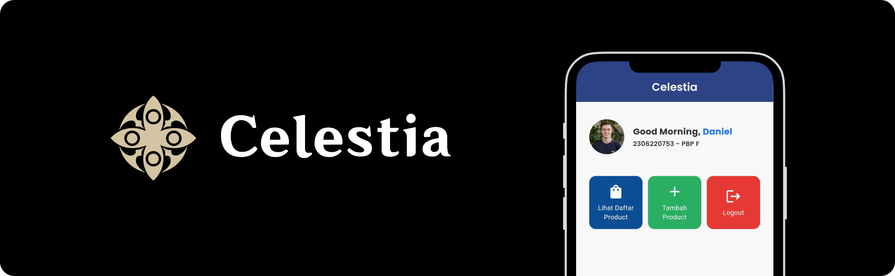

# 

Celestia is a Hoyoverse Official Merchandise E-Commerce that offers some products officially made by Hoyoverse. This Project was made for one of the task in <a href="https://pbp-fasilkom-ui.github.io/ganjil-2025/"> Pemrograman Berbasis Platform (PBP) Gasal 2024/2025</a>.

 

> **Note:**   This is not an actual online shop for Hoyoverse Merchandise.  The mockup design on the banner was taken from [Tokopedia](https://tokopedia.com) Mobile App.

 

# 📝 Assignment
**Nama**    : Daniel Liman 
**NPM**     : 2306220753 
**Kelas**   : PBP F

| Tugas Sebelumnya: | [Tugas 7](https://github.com/hyvos07/celestia-mobile/wiki/Tugas-7) |
|-|-|

 

## Tugas 8
### Kegunaan dari `const` di Flutter

Variable yang ditandai dengan `const` akan memiliki nilai yang sama dari awal aplikasi kita di-build hingga dihapus. Hal ini juga berarti isi dari variable `const` tidak dapat dirubah di kondisi apapun, berbeda dengan `final` yang valuenya bisa ditentukan pada saat aplikasi berjalan (runtime).

Penggunaan const pada widget maupun variable yang kita tambahkan di kode kita bisa memiliki beberapa tujuan dan kegunaan, yaitu sebagai berikut.

- Widget yang konstan tidak akan di-build ulang setiap kali ada perubahan state, sehingga lebih menghemat waktu dan memori yang digunakan di dalam aplikasi kita.
- Konsistensi data yang berada di variable `const` terjaga dengan baik, yang membuatnya lebih mudah untuk diakses pada memori dan membantu proses debugging (karena value yang dimiliki variable `const` akan selalu sama, sehingga lebih mudah untuk dideteksi letaknya).
- Widget atau variable dengan tipe `const` juga meningkatkan performa dari aplikasi yang kita miliki, karena pekerjaan yang harus dilakukan oleh aplikasi kita saat berjalan berkurang.

Waktu yang tepat untuk menggunakan `const` pada variable yang kita miliki juga bergantung dengan tujuan dan maksud dari variable yang kita buat tersebut.

| Sebaiknya memakai `const` | Tidak bisa memakai `const`, tapi bisa pakai `final` | Tidak bisa memakai keduanya. |
| - | - | - |
| Pada image path yang saya definisikan di dalam [assets.dart](lib/core/constants/assets.dart), saya menetapkan setiap image path yang disimpan bersifat constant dengan `const` karena lokasi dari image tersebut akan selalu sama pada device tempat aplikasi kita dijalankan. | Atribut `name` pada class `ItemHomePage` di Tugas 7 kemarin tidak selalu memiliki isi yang sama, namun akan selalu sama setelah valuenya ditentukan saat runtime. Pada kasus ini, penggunaan `final` lebih cocok. | Variable yang valuenya akan berubah-ubah terus berdasarkan input dari pengguna maupun berubah dari waktu ke waktu secara otomatis tidak dapat memiliki isi yang selalu sama, sehingga penggunaan `const` maupun `final` yang mementingkan konsistensi data setelah dideklarasikan tidak cocok pada kasus ini. |

### Perbedaan dari `Column` dan `Row`

`Column` dan `Row` sama-sama memiliki kegunaan dalam mengatur layout dan alignment dari widget-widget yang dibungkusnya secara horizontal maupun vertikal.

| Column | Row |
| - | - |
| Column mengatur widget-widget yang ia bungkus secara **vertikal**. Untuk mengatur alignment yang digunakan dalam penempatan widget-widget tersebut, terdapat `mainAxisAlignment` yang mengatur penempatan secara vertikal dan `crossAxisAlignment` yang mengatur penempatan secara horizontal. | Berbeda dengan column, row mengatur widget-widget yang dibungkusnya secara **horizontal**. Untuk mengatur alignment yang digunakan dalam penempatan widget-widget yang dibungkusnya, terdapat `mainAxisAlignment` yang mengatur penempatan secara horizontal dan `crossAxisAlignment` yang mengatur penempatan secara vertikal. | 

**Tambahan**: `mainAxisAlignment` adalah atribut Column dan Row yang mengatur widget-widget sejajar dengan orientasi penempatan dari setiap layout widget tadi, sedangkan atribut `crossAxisAlignment` mengatur penempatan di arah kebalikan dari orientasi penempatan layout widget tersebut. Detailnya bisa digambarkan lewat ilustrasi yang [disediakan oleh Flutter](https://docs.flutter.dev/ui/layout#aligning-widgets) sendiri di bawah ini.

    
        
    

### Elemen Input yang digunakan pada Tugas 8

Di dalam tugas 8, aplikasi ini mengimplementasikan input form dengan widget input sebagai berikut:
- a
- a
- a
- a
- a
- a

Selain input widget yang dipakai di atas, terdapat beberapa input widget lain bawaan Flutter seperti `Checkbox`, `Switch` dan `Slider`. Selain widget-widget bawaan tadi, banyak tersedia package eksternal dari berbagai widget input yang lebih kompleks dan modern di [pub.dev](https://pub.dev).

### Konfigurasi Tema (Theme) Aplikasi yang Konsisten

Tema pada aplikasi milik kita bisa diatur dalam `ThemeData` yang kita masukkan pada `MaterialApp` di file [`App`](lib/app.dart) yang akan di-render saat aplikasi berjalan. Secara default, `ThemeData` yang akan digunakan pada aplikasi kita adalah `ThemeData.light()` yang memberikan tema "light mode" pada aplikasi kita, dengan `primaryColor` atau warna utama yang dipakai adalah biru yang dimiliki logo Flutter.

Dengan memakai ThemeData, Flutter akan menyimpan data dari warna, ukuran font, maupun konfigurasi lainnya ke dalam aplikasi kita. Jika sewaktu-waktu kita tidak memperinci `Color` maupun `TextStyle` yang akan kita gunakan dalam widget kita, Flutter bisa memakai apa yang telah kita definisikan di `ThemeData`. Dengan begitu, tema dari aplikasi yang kita gunakan bisa terjaga di setiap widget dan page yang kita buat.

Di dalam aplikasi ini sendiri, saya memakai `ThemeData` saya sendiri yang saya definisikan di [`AppTheme`](lib/core/themes/app_theme.dart) pada folder `themes`. Tema ini akan memberikan efek "light mode" dan tampilan ruang kosong pada widget-widget di aplikasi ini menjadi lebih kecil dan merapat.

### Navigasi pada Aplikasi yang Memiliki Banyak Halaman

Pada aplikasi yang memiliki banyak halaman/page yang dapat dikunjungi, kita bisa mengimplementasikan beberapa cara dalam berpindah-pindah halaman yang kita miliki tersebut. Salah satu cara termudah dalam melakukan navigasi antar halaman-halaman tersebut adalah dengan membuat setiap tombol untuk setiap halaman yang ada, seperti yang dilakukan pada aplikasi Tutorial 

Namun, cara tadi tidak efisien dan tidak ideal untuk pengalaman pengguna yang baik. Biasanya, terdapat beberapa pendekatan lainnya seperti:

- **Memakai Drawer/Sidebar**

    Seperti aplikasi Mental Health Tracker yang dibuat di tutorial, navigasi antar halaman bisa diletakkan pada sisi sebelah kiri atau kanan layar yang dapat dibuka dengan memencet icon hamburger atau lainnya.

    

    Sumber: [Pinterest](https://i.pinimg.com/originals/b0/7e/cb/b07ecbe5b18fd8af5a3631e67e16b1f3.gif)

- **Memakai Tab Bar/App Bar**

    Navigasi antar halaman juga bisa dilakukan dengan Tab Navigation Bar yang biasanya terletak di bagian atas aplikasi. Contoh dari aplikasi yang memakai Tab Bar adalah X (sebelumnya Twitter).

    

- **Memakai Bottom Navigation Bar**

    Navigasi antar halaman yang paling sering digunakan pada aplikasi mobile adalah Bottom Navigation Bar. Letaknya yang berada di bawah layar memudahkan pengguna berpindah halaman dengan satu tangan, yang membuatnya lebih sering dipakai dibandingkan dengan drawer atau tab bar

    

    Sumber: [www.thewidlarzgroup.com](https://www.thewidlarzgroup.com/blog/creating-custom-animated-bottom-tab-and-drawer-navigation)

 

Secara personal, saya lebih suka untuk memakai Bottom Navigation Bar dalam menangani navigasi tiap halaman yang aplikasi saya miliki. Saya lebih sering menggunakan Bottom Navigation Bar juga karena pengalaman pengguna yang cara ini miliki lebih baik dalam memberi kemudahan pengguna dalam memakai aplikasi yang kita miliki.